# Отчет по лабораторной работе
*Выполнил __Малыхин Никита Сергеевич__* 

## Цель
Освоить базовые навыки работы с инструментом GnuPG для шифрования и дешифровки файлов и каталогов в операционной системе Linux.

## Решение

### Создание ключа
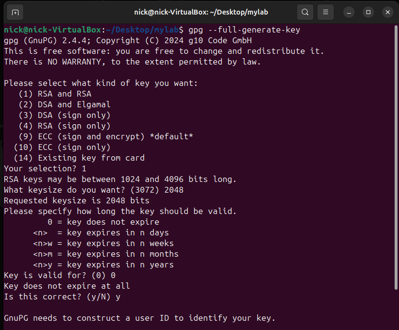
 
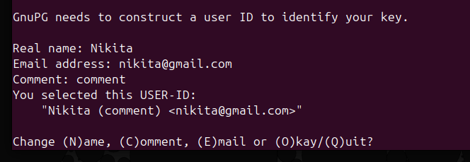
 
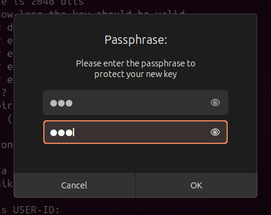

### 1. Шифрование файла:
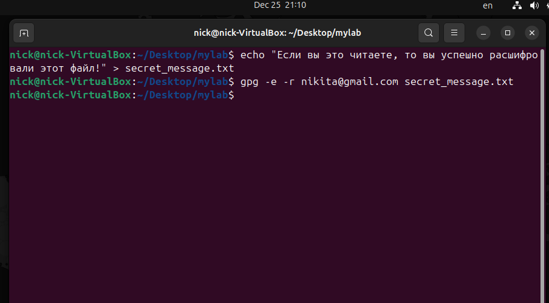
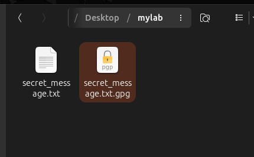

### 2. Дешифровка файла:
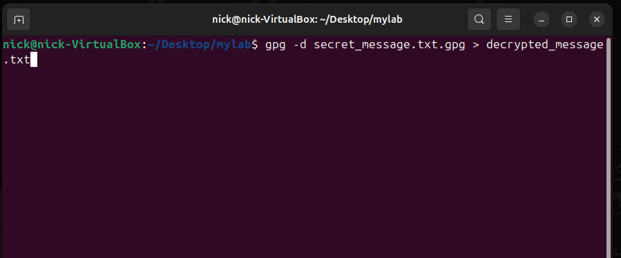
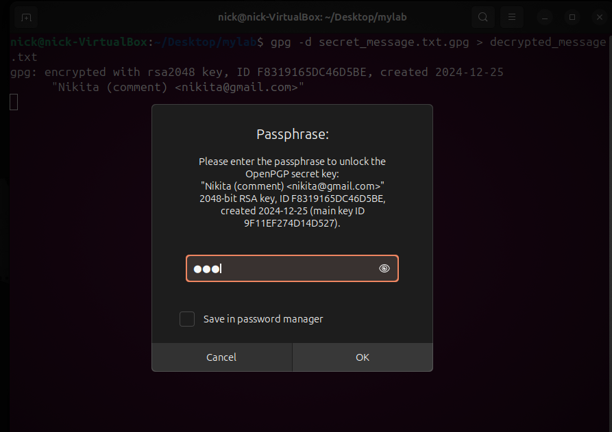
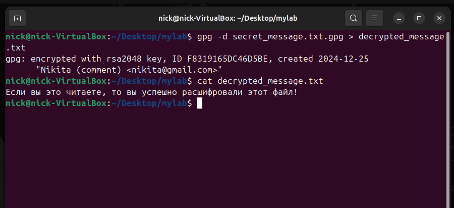

### 3. Шифрование каталога:
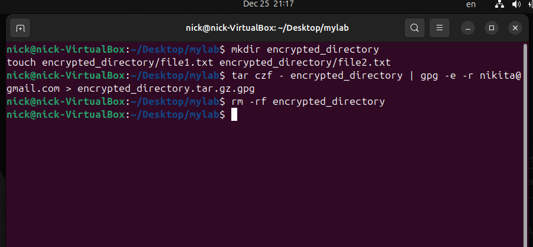
 
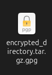

### 4. Дешифровка каталога:
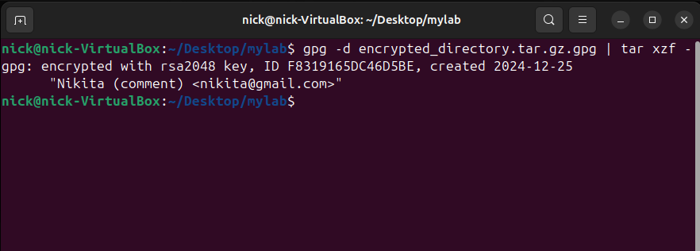
 
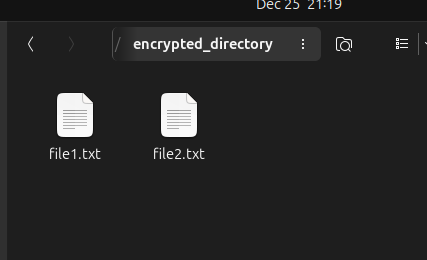
